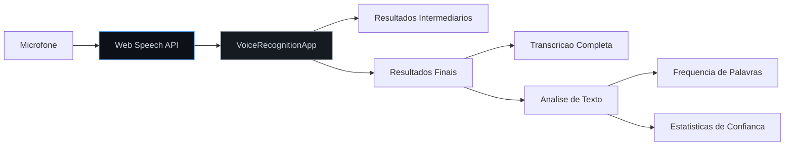
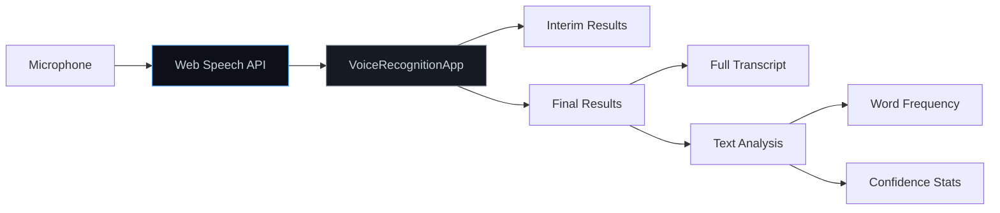

# Voice Recognition Web App

Aplicacao web de reconhecimento de voz utilizando a Web Speech API.

Browser-based speech recognition application using the Web Speech API.


[Portugues](#portugues) | [English](#english)

---

## Portugues

### Visao Geral

Aplicacao web que utiliza a Web Speech API nativa do navegador para reconhecimento de voz em tempo real:

- **Transcricao em tempo real** com resultados intermediarios e finais
- **Multi-idioma**: Suporte a Ingles, Portugues, Espanhol, Frances, Alemao e outros
- **Alternativas de reconhecimento** com niveis de confianca
- **Analise de transcricao**: Contagem de palavras, frequencia e confianca media

### Arquitetura



### Inicio Rapido

```bash
git clone https://github.com/galafis/Voice-Recognition-Web-App.git
cd Voice-Recognition-Web-App

# Abrir index.html no navegador ou servir localmente
npx serve .
```

### Estrutura do Projeto

```
Voice-Recognition-Web-App/
├── main.js           # Classe VoiceRecognitionApp
├── index.html        # Interface web
├── tests/
│   └── main.test.js  # Testes
├── package.json
├── LICENSE
└── README.md
```

---

## English

### Overview

Web application using the browser native Web Speech API for real-time voice recognition:

- **Real-time transcription** with interim and final results
- **Multi-language**: Support for English, Portuguese, Spanish, French, German and more
- **Recognition alternatives** with confidence levels
- **Transcript analysis**: Word count, frequency and average confidence

### Architecture



### Quick Start

```bash
git clone https://github.com/galafis/Voice-Recognition-Web-App.git
cd Voice-Recognition-Web-App
npx serve .
```

---

## Autor / Author

**Gabriel Demetrios Lafis**
- GitHub: [@galafis](https://github.com/galafis)
- LinkedIn: [Gabriel Demetrios Lafis](https://linkedin.com/in/gabriel-demetrios-lafis)

## Licenca / License

MIT License - veja [LICENSE](LICENSE) / see [LICENSE](LICENSE).
